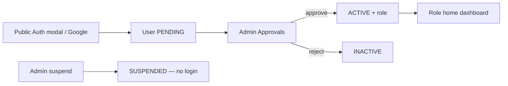

# Alubonets SHG

Public website and member platform for **Alubonets Self-Help Group**.

**Prepared by:** SpectreTech Limited  
**Aligned with:** Solution Design Document (v0) — July 2026  
**Stack:** Next.js 15 · TypeScript · Tailwind · Prisma · Supabase Auth  

**Dev URL:** [http://localhost:3001](http://localhost:3001)

| Doc | Purpose |
|-----|---------|
| **This README** | What the product is and **how it works** |
| [docs/BACKEND_SETUP.md](docs/BACKEND_SETUP.md) | **How to set up** env, Supabase, seed, RLS, Resend, Daraja, deploy |
| [docs/DATA_MODEL.md](docs/DATA_MODEL.md) | Tables, relationships, ERD, **local seed accounts** |
| [docs/DESIGN.md](docs/DESIGN.md) | UI / design tokens |

---

## Quick start

```bash
npm install
copy .env.local.example .env.local   # fill secrets — see BACKEND_SETUP
npm run db:push
npm run db:seed
npm run db:bootstrap-auth
npm run dev
```

Full setup: **[docs/BACKEND_SETUP.md](docs/BACKEND_SETUP.md)**.  
Local seed emails/passwords (dev only): **[docs/DATA_MODEL.md](docs/DATA_MODEL.md#seeded-dev-accounts)**.

---

## What is built (status)

| Layer | Wired end-to-end? |
|-------|-------------------|
| Next.js 15 + Tailwind + TypeScript | Yes — public site + role dashboards |
| Supabase Auth (`@supabase/ssr`) | Yes — login, register, Google callback, middleware |
| Prisma → Supabase Postgres | Yes — live queries on all dashboards |
| Zod validation | Yes — auth + server actions |
| React Hook Form | Partial — native forms + Zod on server |
| Chart.js | Yes — dashboard aggregates |
| Resend | Yes — approval / receipt / welfare (skipped if no key) |
| PapaParse CSV | Yes — treasurer contributions import |
| pdf-lib | Yes — receipt + statement PDFs |
| docx | Yes — meetings export |
| M-Pesa Daraja | Yes — STK + callback (needs Daraja env) |
| Shared `/profile` | Yes — all roles |
| Test JWT (`jose`) | Removed — replaced by Supabase `app_metadata` |

---

## Project map

```
app/
  (public)/          # Home, about, projects, gallery, contact
  admin/             # Admin overview + members, approvals, roles, gallery-queue
  dashboard/         # executive | treasurer | secretary | organizer | member
  profile/           # Shared profile page (all signed-in users)
  auth/callback/     # Google OAuth code exchange
  api/               # auth, pdf, mpesa, export, …
components/          # layout, auth, dashboard shell, profile
lib/                 # prisma, auth, email, data queries, mpesa
prisma/              # schema + seed
supabase/            # policies.sql, storage.sql
docs/                # setup, data model, design
```

---

## How authentication works



1. **Register** only on the public Auth modal (or Google). Creates Supabase Auth user + Prisma `users` row with `status = PENDING`, `role = MEMBER`.
2. **Admin** opens `/admin/approvals` → approve (`ACTIVE`) or reject (`INACTIVE`). Metadata syncs to JWT.
3. **Login** (`/login` or `/admin/login`) uses `signInWithPassword`. Staff admin login has **no** Google button and **no** register.
4. Middleware reads JWT `app_metadata`: `{ role, status, isSuperAdmin, dashboardAccess }` — no Prisma on the Edge.
5. **PENDING** → `/pending` (can still open `/profile`). **SUSPENDED** → signed out with: *“Your account has been temporarily suspended. Please contact the group administrator.”*
6. **Google:** Auth modal → Supabase OAuth → `/auth/callback` upserts Prisma user and redirects to `/pending` or role home.

### Roles and access

| Actor | Approve members | Set EXEC…MEMBER | Set ADMIN | Super Admin flag | Suspend Admins |
|-------|-----------------|-----------------|-----------|------------------|----------------|
| Super Admin | Yes | Yes | Yes | Yes (keep ≥1) | Yes |
| Admin | Yes | Yes | No | No | Non-admins only |
| Others | No | No | No | No | No |

- **Primary `role`** → home path (`ROLE_HOME`): `/admin`, `/dashboard/executive`, … `/dashboard/member`.
- **`dashboardAccess`** → optional extra workspaces; **Workspace** switcher in the dashboard header.
- **Super Admin** always sees every dashboard.
- Shared **profile:** `/profile` for every signed-in user (members and management).

---

## How contributions and payments work

### Manual / CSV (treasurer)

1. Treasurer records a contribution (member, amount, method, optional M-Pesa ref) or uploads CSV (`email, amount, …`).
2. Prisma creates a `contributions` row.
3. Optional Resend receipt email when configured.
4. Member or treasurer downloads **PDF receipt:** `/api/pdf/receipt/[contributionId]`.
5. Member **statement PDF:** `/api/pdf/statement/[userId]` (own history).

### M-Pesa STK Push

1. Treasurer (or allowed role) submits phone + amount via STK form → `POST /api/mpesa/stk`.
2. Daraja sends prompt to the phone; checkout request id is stored for matching (audit / meta).
3. Safaricom calls `POST /api/mpesa/callback` on success/failure.
4. On success the app creates/links a `Contribution` (amount, `mpesaRef`, method `MPESA`).
5. Receipt PDF uses the same contribution row as cash/bank payments.

Without Daraja env vars, STK stays inactive; the rest of finance still works.

---

## How PDFs and Word exports work

| Output | Route / entry | Built with |
|--------|---------------|------------|
| Contribution receipt | `/api/pdf/receipt/[id]` | pdf-lib — group header, member, amount, date, refs |
| Member statement | `/api/pdf/statement/[userId]` | pdf-lib — contribution list for that member |
| Meeting pack | `/api/export/meetings` | docx — title, date, attendance, agenda, minutes |
| Meeting minutes PDF | `/api/pdf/minutes/[id]` | pdf-lib — letterhead from DB text; publish stores copy in `documents` bucket |

Auth checks ensure members only get their own receipts/statements unless staff.

---

## How dashboards work

Each role has an overview plus section pages (nav in `lib/dashboard/nav.ts`):

| Area | Examples |
|------|----------|
| Admin | KPIs, members directory, approvals, roles & dashboard access, gallery queue, suspend/restore |
| Executive | Projects, announcements, contribution charts |
| Treasurer | Contributions, welfare reviews, CSV, M-Pesa STK |
| Secretary | Announcements, meetings, documents |
| Organizer | Events, gallery, projects |
| Member | Own contributions, welfare requests, live announcements |

Charts are server-aggregated (Prisma) and rendered with Chart.js. Announcements on the member home can update via Supabase Realtime when enabled.

---

## How email works

`lib/email/resend.ts` sends when `RESEND_API_KEY` + `FROM_EMAIL` are set. Typical triggers: membership approved, contribution/welfare notices. Sends are logged in `email_logs` when the app records them. Missing keys → no-op (no crash).

---

## How gallery and storage work

1. Organizer/member adds photo metadata (URL today; Storage bucket `gallery` for uploads when wired).
2. Unpublished photos sit in the admin **gallery queue** (`isPublic = false`).
3. Admin publishes → `isPublic = true` → public gallery.
4. Bucket `documents` is private (secretary/admin upload; members via signed URLs / app links).

SQL for buckets: `supabase/storage.sql`.

---

## Scripts

| Command | Description |
|---------|-------------|
| `npm run dev` | Dev server → **:3001** |
| `npm run build` / `start` | Production |
| `npm run lint` | ESLint |
| `npm run db:generate` | Prisma client |
| `npm run db:push` | Sync schema to Supabase |
| `npm run db:migrate` | Versioned migrations |
| `npm run db:seed` | Seed Prisma data |
| `npm run db:bootstrap-auth` | Create/link Supabase Auth users |
| `npm run db:test` | Connection smoke test |
| `npm run db:studio` | Prisma Studio |

---

## Decisions still with the group

1. Hosting domain (recommend Vercel + Supabase).  
2. Official domain name.  
3. M-Pesa Paybill/Till details.  
4. Commercial terms in the Solution Design Document.
