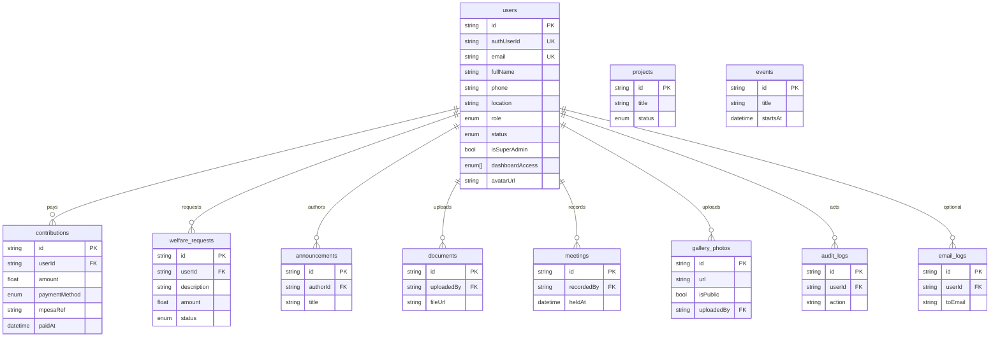

# Alubonets data model

What the group’s app stores in Postgres: tables, columns, relationships, and how Auth links in.

**Source of truth:** [`prisma/schema.prisma`](../prisma/schema.prisma)  
**Postgres (Supabase)** · table names use `@@map` (e.g. `users`, `contributions`).  
**ORM:** Prisma · **Auth identities:** Supabase Auth (`auth.users`) linked via `users.authUserId`.

App writes mostly go through Prisma (service connection; bypasses RLS). Browser Supabase clients are RLS-scoped — see [`supabase/policies.sql`](../supabase/policies.sql).

**How features use this data** (receipts, payments, dashboards): root [README](../README.md).  
**How to connect and seed:** [BACKEND_SETUP.md](./BACKEND_SETUP.md).

---

## ERD (entity relationships)

---

## Enums

| Enum | Values | Used by |
|------|--------|---------|
| `Role` | `ADMIN`, `EXECUTIVE`, `TREASURER`, `SECRETARY`, `ORGANIZER`, `MEMBER` | `users.role`, `users.dashboardAccess[]` |
| `MemberStatus` | `PENDING`, `ACTIVE`, `INACTIVE`, `SUSPENDED` | `users.status` |
| `ProjectStatus` | `UPCOMING`, `ONGOING`, `COMPLETED` | `projects.status` |
| `WelfareStatus` | `PENDING`, `APPROVED`, `REJECTED`, `PAID` | `welfare_requests.status` |
| `PaymentMethod` | `CASH`, `MPESA`, `BANK`, `OTHER` | `contributions.paymentMethod` |

---

## Tables

### `users` (model `User`)

Member and staff profiles. One row per person. Linked to Supabase Auth when `authUserId` is set.

| Column | Type | Notes |
|--------|------|--------|
| `id` | String (cuid) | Primary key (app id, not Auth uuid) |
| `authUserId` | String? unique | Supabase `auth.users.id` |
| `email` | String unique | Login / contact |
| `fullName` | String | Display name |
| `phone` | String? | Optional |
| `location` | String? | Profile location (e.g. Nairobi, Kenya) |
| `role` | Role | **Primary** home dashboard |
| `status` | MemberStatus | Gate for login / middleware |
| `isSuperAdmin` | Boolean | Hierarchy; only supers grant Admin / supers |
| `dashboardAccess` | Role[] | Extra workspaces beyond primary role |
| `avatarUrl` | String? | Profile image URL |
| `createdAt` / `updatedAt` | DateTime | |

**Relations:** owns contributions, welfare requests, audit/email logs; authors announcements; uploads documents & gallery; records meetings.

**JWT sync:** On role/status/access changes, `app_metadata` is updated to `{ role, status, isSuperAdmin, dashboardAccess }` for Edge middleware.

---

### `contributions` (model `Contribution`)

Money received from a member (cash, bank, M-Pesa, etc.).

| Column | Type | Notes |
|--------|------|--------|
| `id` | String | PK |
| `userId` | String FK → users | Cascade delete |
| `amount` | Float | Must be &gt; 0 (DB check in policies.sql) |
| `description` | String? | |
| `category` | String? | e.g. monthly dues |
| `paymentMethod` | PaymentMethod | Default `CASH` |
| `receivedBy` | String? | Who recorded it |
| `statementRef` | String? | Bank / statement ref |
| `paidAt` | DateTime | Payment date |
| `mpesaRef` | String? | M-Pesa receipt / checkout ref |
| `createdAt` | DateTime | Row created |

**Indexes:** `userId`, `paidAt`.

**Flows:** Treasurer form / CSV import / M-Pesa callback → row → PDF receipt `/api/pdf/receipt/[id]`.

---

### `welfare_requests` (model `WelfareRequest`)

Member asks for welfare support; treasurer reviews.

| Column | Type | Notes |
|--------|------|--------|
| `id` | String | PK |
| `userId` | String FK → users | Cascade |
| `description` | String | Need |
| `amount` | Float? | Optional ask |
| `status` | WelfareStatus | Default `PENDING` |
| `reviewNote` | String? | Staff note |
| `createdAt` / `updatedAt` | DateTime | |

---

### `projects` (model `Project`)

Group projects shown on public + executive/organizer dashboards.

| Column | Type | Notes |
|--------|------|--------|
| `id` | String | PK |
| `title` / `description` | String | |
| `status` | ProjectStatus | |
| `imageUrl` | String? | |
| `startDate` / `endDate` | DateTime? | |
| `createdAt` / `updatedAt` | DateTime | |

No FK to users (group-owned).

---

### `gallery_photos` (model `GalleryPhoto`)

| Column | Type | Notes |
|--------|------|--------|
| `id` | String | PK |
| `url` | String | Image URL (or Storage public URL) |
| `caption` / `category` | String? | |
| `isPublic` | Boolean | `false` = approval queue |
| `approvedAt` | DateTime? | Set when published |
| `uploadedBy` | String? FK → users | SetNull on user delete |
| `uploadedAt` | DateTime | |

Public gallery only shows `isPublic = true`. Admin queue: `/admin/gallery-queue`.

---

### `announcements` (model `Announcement`)

| Column | Type | Notes |
|--------|------|--------|
| `id` | String | PK |
| `title` / `content` | String | |
| `authorId` | String FK → users | Cascade |
| `publishedAt` / `createdAt` | DateTime | |

Realtime: clients can subscribe (member home).

---

### `events` (model `Event`)

| Column | Type | Notes |
|--------|------|--------|
| `id` | String | PK |
| `title` | String | |
| `description` / `location` | String? | |
| `startsAt` | DateTime | Required |
| `endsAt` | DateTime? | |
| `createdAt` | DateTime | |

---

### `documents` (model `Document`)

| Column | Type | Notes |
|--------|------|--------|
| `id` | String | PK |
| `title` | String | |
| `fileUrl` | String | URL or Storage path |
| `category` | String? | |
| `uploadedBy` | String FK → users | Cascade |
| `uploadedAt` | DateTime | |

Private Storage bucket `documents` (see `storage.sql`); signed URLs for downloads.

---

### `meetings` (model `Meeting`)

| Column | Type | Notes |
|--------|------|--------|
| `id` | String | PK |
| `title` | String | |
| `agenda` / `minutes` | String? | |
| `heldAt` | DateTime | |
| `attendance` | Int | Default 0 |
| `recordedBy` | String FK → users | Secretary / admin |
| `createdAt` / `updatedAt` | DateTime | |

Export: `/api/export/meetings` (DOCX).

---

### `email_logs` (model `EmailLog`)

| Column | Type | Notes |
|--------|------|--------|
| `id` | String | PK |
| `userId` | String? FK | Optional member link |
| `toEmail` / `subject` | String | |
| `template` | String? | Template key |
| `status` | String | e.g. `sent` |
| `meta` | Json? | Provider ids, etc. |
| `createdAt` | DateTime | |

---

### `audit_logs` (model `AuditLog`)

| Column | Type | Notes |
|--------|------|--------|
| `id` | String | PK |
| `userId` | String FK | Actor |
| `action` | String | e.g. `MEMBER_APPROVE`, `PROFILE_UPDATE` |
| `entity` / `entityId` | String? | Target |
| `meta` | Json? | Extra payload |
| `createdAt` | DateTime | |

---

## Auth vs app data

| Store | What lives there |
|-------|------------------|
| **Supabase Auth** | Email/password or Google identity, session cookies, `app_metadata` claims |
| **`users` table** | Role, status, profile fields, dashboard grants, business FKs |
| **Storage buckets** | `gallery` (public read), `documents` (private) — not Prisma tables |

Linking: register / OAuth / bootstrap sets `users.authUserId = auth.users.id`.

---

## Seed snapshot (dev)

After `npm run db:seed` + `npm run db:bootstrap-auth`, Prisma has sample users, contributions, projects, etc.

**Full login table (emails + passwords + dashboards):** see the root [README — Seeded test logins](../README.md#seeded-test-logins-local-only).

Change those passwords before any shared or production use.

---

## Changing the schema

1. Edit `prisma/schema.prisma`  
2. `npm run db:push` (or `db:migrate`)  
3. `npm run db:generate`  
4. If RLS column names change, update `supabase/policies.sql` and re-run  
5. Update this file + seed if needed  
